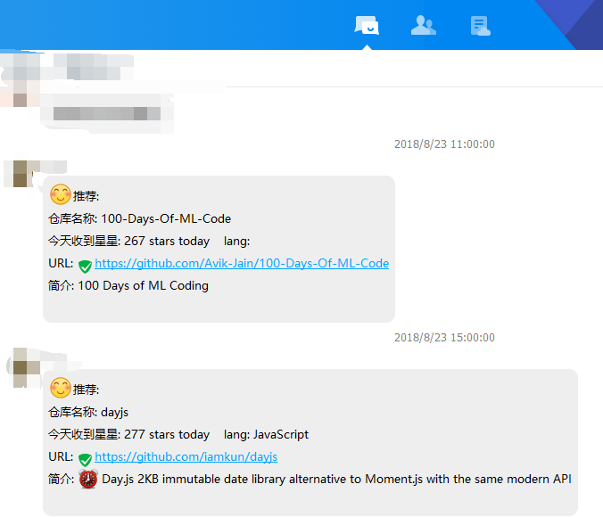

# GitHub 热门仓库推送
我们都知道 GitHub 是个宝啊。但时常因为没有时间，可能并不会登陆 Github。
但是我们无论怎么没有时间，社交软件总是会打开的。
所以就有了这个项目，将GitHub热门仓库推送到QQ技术群。

## 项目依赖

后端抓取仓库： maven, junit, spring, junit, mybatis, slf4j, logback

前端推送仓库：python, qq-bot(https://github.com/pandolia/qqbot)

## 项目流程

项目流程很简单的啦，每天定时任务，抓取GitHub 热门仓库。

qq-bot 选取仓库推送QQ群。

每天抓取下来的项目还是有十几个，我们不可能将这些仓库全部推送到QQ群啊，这不成了骚扰了吗。

所以我们只需要推送1个到2个就行了，怎么选呢？面向的都是中国人，那么就尽量选择中文仓库吧。

Q：日积月累下来多余的仓库怎么办呢？

A：做个定时任务每隔3天就删除吧。

## 项目部署

1. 在 resources 文件夹下添加 db.properties。

   ```
   jdbc.driver = com.mysql.cj.jdbc.Driver
   jdbc.url = jdbc:mysql://localhost:3306/GitHubTrendingPush?characterEncoding=utf-8
   jdbc.username = root
   jdbc.password = 
   ```

2. 创建数据库

   创建数据库，参照该 bean 熟悉创建表:

   ```
   public class Repository {
       private Integer id;
       private String name;
       private String URL;
       private String todayStar;
       private String intro;
       private String lang;  // 用什么语言写的
       private String author;
       private Date firstDate;  // 第一次发现仓库的时间
       private Boolean send; // 这个仓库是否推送
   ```

3. 参考qq-bot(https://github.com/pandolia/qqbot) 或者其他 bot 推送你的仓库吧。

建议：不要选择基于 web-qq 协议的 bot，不稳定且腾讯快禁止了 web-qq 协议的使用了。

## 项目运行

让我们来看看运行效果吧：



